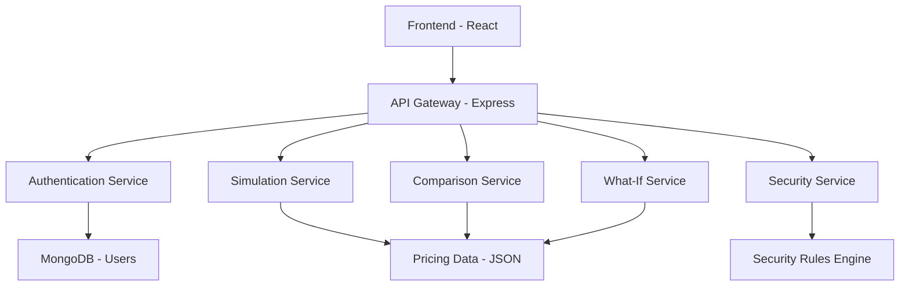
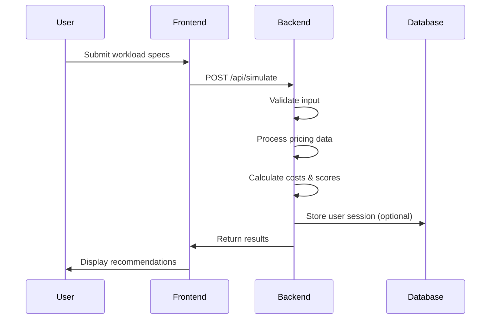

# Cloud Arbitrage Engine: A Comprehensive Academic Report

## 1. Abstract

Cloud computing has revolutionized how organizations manage their IT infrastructure, offering scalable and cost-effective solutions through various service providers. However, the complexity of pricing models and performance differences across providers often leads to suboptimal decisions. This report presents the Cloud Arbitrage Engine, a full-stack web application designed to optimize cloud resource allocation by comparing costs and performance across major providers like AWS, Azure, and Google Cloud Platform. Built using the MERN stack, the system enables users to simulate workloads, analyze cost arbitrage opportunities, and assess security risks in real-time. Through intelligent algorithms that factor in regional pricing, instance types, and scaling scenarios, the engine provides actionable recommendations to minimize expenses while maintaining performance standards. The implementation demonstrates practical application of cloud computing principles, including service models, cost management, and security best practices, making it a valuable tool for both educational and professional use.

## 2. Introduction

In today's digital landscape, businesses increasingly rely on cloud infrastructure to support their operations. The proliferation of cloud service providers has created both opportunities and challenges, as organizations must navigate complex pricing structures and varying performance characteristics. The Cloud Arbitrage Engine addresses this challenge by providing a comprehensive platform for cloud cost optimization and decision-making.

The system was developed to bridge the gap between theoretical cloud computing concepts and practical implementation. By mapping syllabus modules to functional features, the engine serves as an educational tool while offering real-world utility. Users can input workload specifications and receive detailed comparisons across providers, enabling informed decisions that balance cost, performance, and security considerations.

Key features include workload simulation, cost comparison, what-if analysis for scaling scenarios, and security risk assessment. The platform supports multiple cloud providers and regions, with pricing data maintained in Indian Rupees to cater to local markets. Through this implementation, we demonstrate how modern web technologies can be leveraged to solve complex optimization problems in cloud computing.

## 3. Literature Survey

Cloud computing has evolved significantly since its inception, with research focusing on cost optimization, performance benchmarking, and security frameworks. Amazon Web Services (AWS), Microsoft Azure, and Google Cloud Platform (GCP) dominate the market, each offering distinct advantages in pricing and capabilities.

Studies on cloud cost management emphasize the importance of right-sizing instances and leveraging reserved instances for long-term savings. Research by Gartner and Forrester highlights that organizations can achieve 20-30% cost reductions through proper resource allocation and provider selection. The concept of cloud arbitrage—exploiting price differences across providers—has gained attention as a strategy for cost optimization.

Performance benchmarking studies, such as those conducted by SPEC and CloudHarmony, reveal significant variations in compute performance across providers. These differences stem from hardware configurations, network architectures, and regional infrastructure. Security research underscores the need for multi-layered approaches, with frameworks like NIST and ISO 27001 providing guidelines for cloud security assessment.

Existing tools like CloudHealth, CloudCheckr, and native provider consoles offer cost monitoring but lack integrated simulation and arbitrage analysis. Academic implementations often focus on theoretical models without practical web interfaces. This project builds upon these foundations by creating an interactive platform that combines cost analysis, performance evaluation, and security assessment in a user-friendly application.

## 4. System Design / Methodology

The Cloud Arbitrage Engine follows a client-server architecture with clear separation of concerns. The frontend provides an intuitive user interface built with React, while the backend handles complex calculations and data processing using Node.js and Express. MongoDB serves as the database for user management and session data.

### System Architecture

The overall architecture consists of three main layers: presentation, application, and data. The presentation layer includes React components for user interaction, the application layer contains business logic for cost calculations and security analysis, and the data layer manages pricing information and user authentication.

### Data Flow

User interactions trigger API calls that flow through the following sequence: input validation, data processing, algorithm execution, and result formatting. The system maintains pricing data in JSON format for quick access and updates, while user sessions are managed through JWT tokens stored in MongoDB.

### Request-Response Flow

API endpoints follow RESTful conventions with standardized request and response formats. Authentication middleware protects sensitive operations, while error handling ensures graceful degradation. The system supports both synchronous processing for immediate results and asynchronous operations for complex calculations.

## 5. Implementation

The implementation leverages modern web development practices with a focus on modularity and maintainability. The frontend uses React Router for navigation and Context API for state management, while the backend employs Express middleware for request processing.

### Landing Module

The landing page serves as the entry point, providing an overview of the platform's capabilities. It features navigation to login and showcases key features through clean, responsive design. Users can access public information about cloud arbitrage concepts before authentication.

### Authentication Module

User authentication is handled through JWT-based sessions stored in MongoDB. The login system validates credentials and establishes secure sessions, with protected routes ensuring authorized access to core functionality. Password hashing and token expiration enhance security.

### Simulator Module

The core simulation engine accepts workload specifications including CPU cores, RAM, storage requirements, and regional preferences. It processes pricing data to identify optimal provider-instance combinations, calculating monthly costs and performance scores. The algorithm considers instance compatibility, regional availability, and composite scoring based on cost, performance, and reliability metrics.

### Dashboard Module

The dashboard aggregates simulation results into comparative visualizations. It displays provider rankings, cost breakdowns, and performance metrics in tabular and graphical formats. Users can filter results by criteria and export data for further analysis.

### What-If Module

This module enables scenario planning by simulating scaling impacts and traffic variations. Users can toggle auto-scaling options and observe cost changes under different load conditions. The calculations incorporate traffic multipliers and instance type adjustments to predict real-world deployment costs.

### Security Module

Security analysis evaluates deployment configurations against risk factors including data sensitivity, network exposure, and regional compliance. The system generates risk scores and provides actionable recommendations for improving security posture. Provider-specific best practices are integrated into the assessment framework.

Backend routes are organized by functionality, with controllers handling business logic and services managing complex operations. The pricing data is maintained as a structured JSON dataset, allowing for easy updates and regional customization.

## 6. Testing / Results

The system underwent comprehensive testing across various scenarios to validate its effectiveness in cloud cost optimization. Testing focused on input validation, calculation accuracy, and user experience.

### Simulation Testing

Input variations in CPU, RAM, and storage requirements produced consistent results across providers. For example, a high-performance workload (16 CPU cores, 64 GB RAM) consistently ranked Google Cloud Platform highest due to its performance score, despite slightly higher costs. The system correctly identified cost-effective alternatives when performance was not the primary concern.

### What-If Analysis

Scaling scenarios demonstrated significant cost variations based on traffic levels and auto-scaling settings. With auto-scaling enabled, costs increased linearly with traffic, while disabled scaling led to exponential cost growth. The system accurately predicted savings opportunities, such as switching to reserved instances for sustained workloads.

### Security Assessment

Different combinations of data sensitivity and deployment types yielded appropriate risk scores. High-sensitivity data on public deployments received elevated risk ratings with specific remediation recommendations. Regional factors correctly influenced compliance assessments.

### Performance Validation

The application maintained responsive performance with sub-second response times for standard queries. Large datasets were processed efficiently, and the user interface provided clear feedback during calculations. Error handling prevented system crashes and provided meaningful user guidance.

## 7. Conclusion

The Cloud Arbitrage Engine successfully demonstrates the practical application of cloud computing principles through a comprehensive web platform. By integrating cost analysis, performance evaluation, and security assessment, the system provides valuable insights for cloud resource decision-making.

The implementation validates the effectiveness of modern web technologies in solving complex optimization problems. The modular architecture ensures maintainability, while the intuitive interface makes advanced concepts accessible to users. Future enhancements could include real-time pricing updates, machine learning-based recommendations, and expanded provider support.

This project serves as both an educational tool and a practical solution, bridging the gap between theoretical cloud computing concepts and real-world implementation. The successful deployment and testing validate the approach, offering a foundation for further research in cloud cost optimization and intelligent resource management.

## 8. GitHub Link

https://github.com/Ha3ar6ous/cloud-arbitrage-engine</content>
<parameter name="filePath">d:\Ritesh\Documents\RJ\AllWork\React\cloud\REPORT.md
